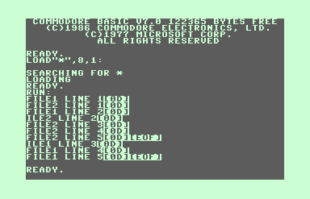
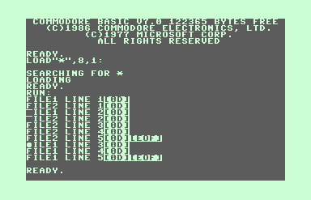
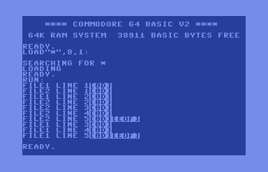

Reproducer for `CHKIN` bug seen on Commodore 128
================================================

While porting [DurexForth](https://github.com/jkotlinski/durexforth) to the Commodore 128, I came across an apparent bug in the 128's ROM, where, if multiple files on the same device are open for reading, calling `CHKIN` to switch between them sometimes causes the next character to be lost or garbled.

This repository contains my attempt to isolate the issue and find a minimal reproducer for it, outside of the somewhat complex file-handling logic that I first encountered the issue in.

If a workaround for the issue becomes apparent, this repository will be updated with a code example.

The nature of the bug
---------------------

The issue manifests slightly differently depending on whether the files are being read from a 1541 or 1571 disk drive: on a 1571, the first character read after an affected `CHKIN` is sometimes, but not always dropped. However, on a 1541, the issue manifests as the first character being garbled, and appears to happen every time.

I have only been able to reproduce the issue on a C128 running in native mode - on a C64, or a C128 running in C64 mode, the issue does not appear to occur:

| System          | Drive | Results                        |
|-----------------|-------|--------------------------------|
| C128, 128 mode  | 1571  | Dropped characters, sporadic   |
| C128, 128 mode  | 1541  | Garbled characters, consistent |
| C64             | 1541  | OK                             |
| C64             | 1571  | OK                             |

The issue has been confirmed on the following hardware:

- NTSC C128DCR
- NTSC 'breadbin' C64
- Old-style 1541 disk drive
- External 1571 disk drive
- 128DCR internal 1571 disk drive
- 1541 Ultimate II emulating a 1541-II

I do not have any PAL systems to test on, but emulated PAL systems exhibit the exact same behavior.

Reproducing the bug
-------------------

The issue appears to be triggered under the following conditions:

- Two or more SEQ or PRG files (let's call them `A` and `B`) are open for input, on the same device.
- Data has been read from both files (i.e. their file pointers are nonzero)
- File `A` is the current input source, and `CHKIN` is called to change the input source to file `B`

When these conditions are true, the next byte read with `CHRIN` from file `B` will either be garbled (1541) or may have skipped ahead and 'lost' one byte since the preivous read (1571).

Building and running the test
-----------------------------

[readtest.asm](./readtest.asm) is an [ACME](https://sourceforge.net/projects/acme-crossass/) assembler source that demonstrates the issue by reading from two files (`file1` and `file2`) in the following pattern:

- One line from file1
- One line from file2
- One line from file1
- All remaining lines of file2
- All remaining lines of file1

It can be assembled for C128 or C64 by defining `TARGET` as '64' or '128' (`-DTARGET=64` or `-DTARGET=128`).

[readtestb.bas](./readtestb.bas) is a BASIC program that does more-or-less the same thing, and will run on both the C64 and C128. Interestingly, it does *not* seem to trigger this issue. Note that because it is a BASIC V2 program, VICE autoloading will fail on the C128 - it must be loaded manually with `LOAD "*",8` (not `,8,1`).

If you have a Unix-like shell (Msys on Windows works too), with ACME and VICE on your path, the included Makefile will automate building and launching a disk image containing the `readtest` program and suitable input files:

`make DRIVE=1541 run` will build and run the C128 version with a 1541 drive

`make DRIVE=1571 run` will build and run the C128 version with a 1571 drive

`make DRIVE=1571 run64` will build and run the C64 version with a 1571 drive

If `DRIVE` is not specified, a 1571 drive will be used in both cases.

Test results
------------
### `file1` contents:
```
FILE1 LINE 1
FILE1 LINE 2
FILE1 LINE 3
FILE1 LINE 4
FILE1 LINE 5
```

### `file2` contents:
```
FILE2 LINE 1
FILE2 LINE 2
FILE2 LINE 3
FILE2 LINE 4
FILE2 LINE 5
```

### Expected output

```
FILE1 LINE 1[0D]
FILE2 LINE 1[0D]
FILE1 LINE 2[0D]
FILE2 LINE 2[0D]
FILE2 LINE 3[0D]
FILE2 LINE 4[0D]
FILE2 LINE 5[0D][EOF]
FILE1 LINE 3[0D]
FILE1 LINE 4[0D]
FILE1 LINE 5[0D][EOF]
```

### C128, 1571
First character after `CHKIN` gets dropped (but not every time):



### C128, 1541
First character after `CHKIN` gets garbled:



### C64, 1541 or 1571
No data corruption:


